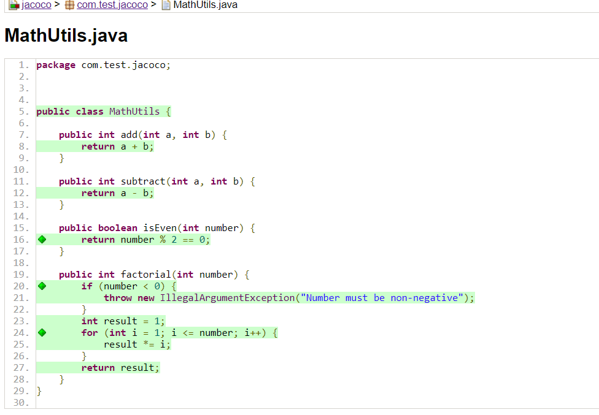

## MathUtil Project - JaCoCo Integration

This project demonstrates how to use JaCoCo to measure test coverage in the MathUtil project, 
which provides basic mathematical operations.




### Steps to Add JaCoCo
- Add the JaCoCo plugin to the pom.xml:

```
<build>
    <plugins>
        <plugin>
            <groupId>org.jacoco</groupId>
            <artifactId>jacoco-maven-plugin</artifactId>
            <version>0.8.8</version>
            <executions>
                <execution>
                    <goals>
                        <goal>prepare-agent</goal>
                    </goals>
                </execution>
                <execution>
                    <id>report</id>
                    <goals>
                        <goal>report</goal>
                    </goals>
                    <phase>test</phase>
                </execution>
            </executions>
        </plugin>
    </plugins>
</build>
```

### Run tests with coverage:

```
mvn clean test
```

### Generate a coverage report:


```
mvn jacoco:report
```

#### The report will be generated in target/site/jacoco/index.html. Open this file in a browser to view the code coverage details.
